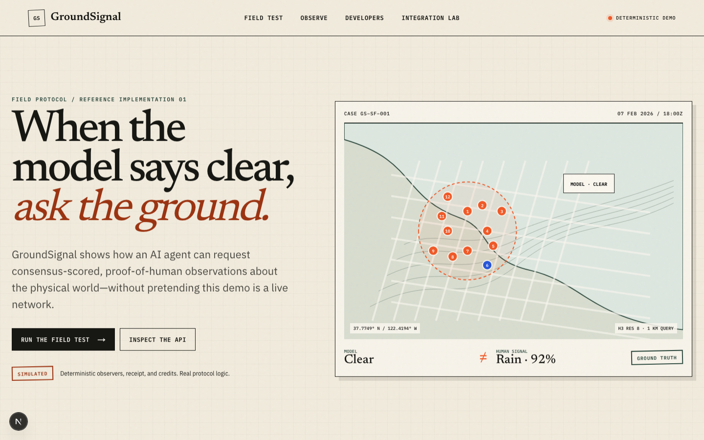

# GroundSignal

[](https://github.com/wally-tribute-labs/agentkit-hackathon/actions/workflows/ci.yml)
[](LICENSE)

> When the model says clear, ask the ground.

GroundSignal is an open-source reference implementation for consensus-scored, proof-of-human observations about the physical world. Weather is the v1 adapter: a deterministic San Francisco scenario shows a forecast saying clear while twelve explicitly simulated observers report eleven rain and one cloudy, producing 91.67% agreement and a `ground_truth` signal.

The default experience is a practical demo, not a live network. It needs no users, wallet, database account, credentials, or paid infrastructure.



[Watch the deterministic demo recording](docs/assets/groundsignal-demo.webm) ·
[Consensus trace screenshot](docs/assets/groundsignal-consensus.png) ·
[Agent console screenshot](docs/assets/groundsignal-developers.png) ·
[Mobile field test](docs/assets/groundsignal-mobile.png)

## What is real

- A pure TypeScript consensus engine using H3 resolution 8 and thirty-minute UTC windows.
- A deterministic replay, a browser-local contribution, and one shared typed agent response.
- A free fixture API and an optional x402 Base Sepolia endpoint.
- Explicit SQLite migrations and repositories for single-instance self-hosting.
- Credential-gated adapters for World ID 4, AgentKit, and XMTP.

All demo observers, receipts, and credits are labeled `SIMULATED`. GroundSignal makes no claim of live users, contributor earnings, mainnet settlement, or production-grade geolocation fraud prevention.

## Quick start

Requirements: Node.js 22 and npm.

```bash
npm ci
cp .env.example .env.local
npm run dev
```

Open [http://localhost:3000](http://localhost:3000), then run the field test at `/demo`.

```bash
# All local quality gates
npm run check

# Browser tests (install Chromium once)
npx playwright install chromium
npm run test:e2e
```

## API

The free endpoint is immutable and deterministic:

```bash
curl 'http://localhost:3000/api/demo/weather?scenario=sf-rain-v1'
```

The developer console at `/developers` displays the exact request and response. OpenAPI 3.1 is served at `/api/v1/openapi`.

The paid endpoint is disabled until all x402 variables are configured. Missing configuration returns `503 INTEGRATION_DISABLED`; GroundSignal never inserts a zero-address or facilitator fallback.

## Runtime modes

`GROUNDSIGNAL_MODE=demo` is the default and the only supported Vercel mode. It never imports or initializes SQLite. Server APIs use immutable fixtures; visitor data stays under the versioned browser key `groundsignal.demo.v1`.

`GROUNDSIGNAL_MODE=sqlite` is for one writable Node process:

```bash
GROUNDSIGNAL_MODE=sqlite npm run db:migrate
GROUNDSIGNAL_MODE=sqlite npm run db:seed
GROUNDSIGNAL_MODE=sqlite npm run dev
```

SQLite mode is not supported on stateless, multi-instance, or serverless deployment. See [Self-hosting](docs/SELF_HOSTING.md).

## Project map

```text
src/core/        framework-independent rules, schemas, fixtures
src/server/      runtime config, SQLite, sessions, weather adapter
src/app/         Next.js pages and public Route Handlers
src/components/  interactive field-journal UI
xmtp/            standalone messaging process
examples/        agent buyer example
docs/            architecture, threat model, demo, self-hosting
```

## Optional integrations

Visit `/lab` for configuration status. A configured adapter is not called verified until an owner runs and records the external acceptance gate.

- World ID: IDKit 4 RP signatures and server verification. Proof bodies and raw coordinates are never logged.
- x402: Base Sepolia through `https://x402.org/facilitator`; settlement occurs only after a successful handler response.
- AgentKit: hooks-based verification with atomic SQLite usage and nonce storage for a three-request free trial.
- XMTP: standalone listener that calls GroundSignal over HTTP rather than importing its database.

Weather model data is attributed to [Open-Meteo](https://open-meteo.com/). Map tiles are attributed to [OpenStreetMap](https://www.openstreetmap.org/copyright).

## Documentation

- [Architecture](docs/ARCHITECTURE.md)
- [Threat model](docs/THREAT_MODEL.md)
- [Demo guide](docs/DEMO.md)
- [Self-hosting](docs/SELF_HOSTING.md)
- [Project provenance](docs/PROVENANCE.md)
- [Contributing](CONTRIBUTING.md)
- [Security policy](SECURITY.md)

## License

[MIT](LICENSE)
