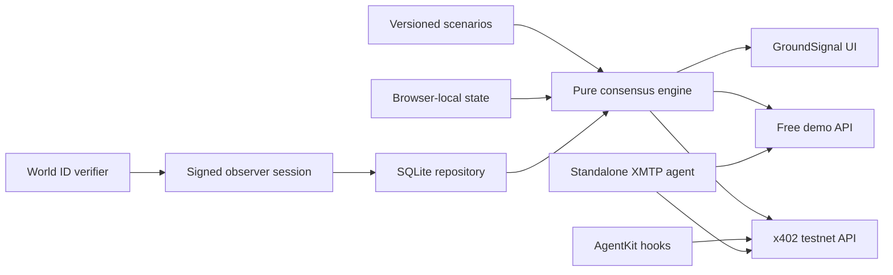

# Architecture

GroundSignal separates deterministic domain logic from runtime adapters so the same evidence produces the same answer in the replay, browser sandbox, free API, SQLite self-host, and paid testnet route.

## Boundaries

- `src/core` has no Next.js, database, wallet, or network imports.
- `demo` mode resolves only versioned fixtures on the server and browser-local extensions in the client.
- `sqlite` mode dynamically loads repositories inside request-time code. Migrations never run on import.
- public contracts are Route Handlers; Server Components do not call internal HTTP endpoints.
- Leaflet, IDKit, and other browser-only code are lazy route-specific client chunks.
- x402, AgentKit, and facilitator initialization happen only after query and environment validation.

## Consensus invariant

An observer has at most one effective vote per H3 cell and UTC thirty-minute window. Imported evidence is defensively deduplicated by keeping the most recently received report. SQLite enforces the invariant with a unique index.

| Unique observers | Required agreement | Tier |
| ---: | ---: | --- |
| 1–2 | any non-tie | `sparse` |
| 3–4 | ≥60% | `corroborated` |
| 5–9 | ≥70% | `strong` |
| ≥10 | ≥80% | `ground_truth` |

Exact ties or populations below their threshold are `contested`. Money is represented as integer micro-USDC.

## Runtime data

Demo fixtures are immutable source files. Browser state contains only a demo observer ID, scenario ID, replay cursor, one demo report, and accessibility preference. SQLite stores pseudonymous observer IDs, H3 cells, timestamps, evidence, bounded notes, and optional accuracy bands—never raw coordinates or World ID proof payloads.
