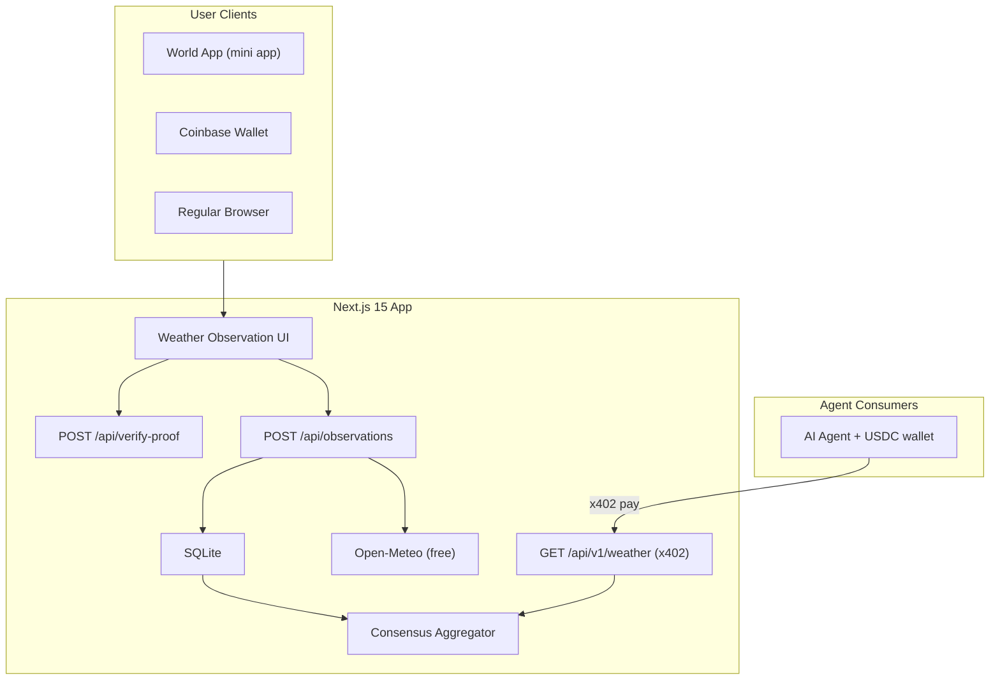

# World Hack: Human-Verified Weather Oracle

## How we got here

### The hackathon context

- World Chain hackathon focused on **AgentKit** (proof of human for AI agents) and **x402 protocol** (HTTP-native payments for agents)
- Partner's brief: "Something using agent kit and by having proof of human the bot can make money"
- Stack: Next.js/TypeScript

### Research journey

**1. AgentKit + x402 landscape**
We researched World's AgentKit (launched March 17, 2026), which extends x402 with cryptographic proof that an AI agent is backed by a verified unique human via World ID. Key primitives: AgentBook (on-chain registry), x402 (HTTP 402 micropayments), World ID (zero-knowledge proof of personhood). Modes: free, free-trial, discount for human-backed agents.

**2. ADIN integration assessment**
Explored the existing ADIN repo (`/Users/greg/Documents/GitHub/adin-chat`) — a full AI chat platform with x402 payments already wired up on Base/Base Sepolia, wallet-based user resolution, 20+ integrations, and a mature AI tool architecture. Key reusable patterns: `x402-next` middleware, `withX402` wrapper, `extractPayer` helper, `walletUsers` service, OpenAPI spec generation.

**3. Product direction exploration**
We explored several directions and stress-tested each:

- **"ADIN + AgentKit" (API with human-verified tier)**: Technically easy but the human's role after auth was passive — just lending identity. No compelling reason for the human.
- **"Human does micro-work for agents"**: Mechanical Turk with extra steps. Not exciting.
- **"Proof-of-human as a passkey"**: Agent gets past gates because it's human-backed. Human is customer, not worker. Good concept but too abstract for a demo.

**4. The "human as sensor" pivot**
User suggested: what if humans confirm local weather? This led to researching device sensor APIs (barometers not accessible from web apps), hyperlocal weather data value, and the DePIN landscape (WeatherXM, Silencio, Hivemapper).

**5. World App Mini Apps discovery**
Discovered World App supports mini apps (web apps in WebView, ~38M users, MiniKit SDK, native payments). Mini apps get GPS, camera, microphone but NOT barometer. Developer rewards up to $100K/week in WLD. This became the distribution strategy.

**6. Cross-wallet play**
Confirmed one web app can serve World App (MiniKit native), Coinbase Wallet (dapp browser), and regular browsers (IDKit widget). World ID verification always completes in World App but can be initiated from anywhere via QR/deep link.

**7. x402 demand reality check**
Discovered x402 Atlas weather data was likely placeholder/fake (addresses matched UNI/WETH contracts). Real x402 demand from x402list.fun: Data (11M txns), Developer (6.8M), AI (6.1M), DeFi (5M), Storage (3.4M), Identity (3M). Weather is NOT a top category. Total recent flow: ~$75.5K/week.

**8. Economics reality check**
Honest math: even at optimistic scale (10K queries/day at $0.01), per-human take-home is ~$0.20/day. Not worth anyone's time. Consensus aggregation (multiple verified humans confirming) creates a premium data tier, but the total addressable market for human-verified weather is narrow. Developer rewards ($100K/week WLD pool) are a larger revenue opportunity but are platform subsidy, not sustainable product economics.

### Open question for post-hackathon

The concept of "proof of human verification service" has legs, but weather may not be the right vertical. Higher-value verticals where human verification commands real money: on-chain data verification, security audit triage, AI output grounding, DeFi signal confirmation. The architecture built here should translate to any vertical.

---

## What we're building

A World Mini App where verified humans report local weather conditions, paired with free model data from Open-Meteo. Agents query the aggregated, consensus-scored data via x402. The delta between model prediction and human ground truth is the product.

### Architecture



### Tech stack

- **Next.js 15** App Router + TypeScript + Tailwind CSS
- **`@worldcoin/minikit-js`** + **`@worldcoin/idkit`** for World ID
- **wagmi** with worldApp + coinbaseWallet connectors
- **`x402-next`** + **viem** for x402 payment gating
- **Open-Meteo API** (free, no key) for model baseline
- **SQLite** via better-sqlite3 for observation storage
- **Leaflet** or Mapbox for map visualization

### User flow

1. Open app (World App / Coinbase Wallet / browser)
2. Verify with World ID (native in World App, QR widget elsewhere)
3. GPS auto-captured, Open-Meteo baseline fetched and displayed
4. Quick-select: condition (Clear/Cloudy/Rain/Snow/Fog/Storm/Windy/Haze), intensity (Light/Moderate/Heavy), feel (Freezing/Cold/Cool/Mild/Warm/Hot)
5. Optional: snap a photo, add a note
6. Submit — observation stored with model baseline and delta

### Agent API (x402-gated)

- `GET /api/v1/weather?lat={lat}&lon={lon}&radius={m}` — returns consensus-scored observations
- Dynamic pricing by signal strength: solo ($0.001), corroborated ($0.005), strong consensus ($0.01), ground truth ($0.02)
- Response includes: consensus condition, agreement rate, confirmation count, model delta, signal strength tier

### Key data model

- **Observation**: humanId, lat/lon, timestamp, condition, intensity, feel, confirmsModel, note, photoPath, model baseline data
- **Consensus cell**: geofence (lat/lon rounded to ~500m), time window (30 min), aggregated condition, agreement rate, unique human count, signal strength tier

### Geofence consensus logic

- Group observations by H3 hex cell (or simple lat/lon grid ~500m) + 30-min time window
- Count unique humanIds per cell
- Calculate agreement rate (most-common condition / total reports)
- Assign signal strength: 1 = solo, 3-5 = corroborated, 5-10 = strong, 10+ = ground truth
- Price queries dynamically based on signal strength

### Revenue distribution

- First reporter in a cell gets bonus share
- Confirming reporters get base share
- Revenue pool per cell grows as agents query it
- All reporters in the cell/window split proportionally

### File structure

```
world-hack/
  src/
    app/
      layout.tsx                    -- providers (MiniKit, wagmi, session)
      page.tsx                      -- landing / verify
      globals.css
      (protected)/
        observe/page.tsx            -- main observation UI
        dashboard/page.tsx          -- map + earnings
      api/
        verify-proof/route.ts       -- World ID verification
        observations/route.ts       -- POST submit observation
        v1/
          weather/route.ts          -- GET x402-gated agent API
          openapi/route.ts          -- OpenAPI spec
    lib/
      x402/config.ts                -- route configs (from ADIN pattern)
      weather/openmeteo.ts          -- Open-Meteo client
      weather/consensus.ts          -- aggregation + scoring
      db/index.ts                   -- SQLite setup
      db/schema.ts                  -- tables
      providers.tsx                 -- client providers
    components/
      WeatherObserver.tsx           -- quick-select buttons
      SkyPhoto.tsx                  -- camera capture
      ObservationMap.tsx            -- Leaflet/Mapbox map
      VerifyButton.tsx              -- World ID (MiniKit vs IDKit)
      SignalBadge.tsx               -- signal strength indicator
    types/
      weather.ts                    -- shared types
```

### Environment variables

```
NEXT_PUBLIC_APP_ID=app_...          # World Developer Portal
AUTH_SECRET=...                     # NextAuth secret
HMAC_SECRET_KEY=...                 # Wallet nonce HMAC
AUTH_URL=https://...                # Public URL
X402_PAY_TO=0x...                   # USDC receiving address
X402_NETWORK=base-sepolia           # Testnet for hackathon
```

### Demo script (2 min)

1. Show the app in World App — verified, GPS locked, model data displayed
2. Quick-tap weather conditions — 5 seconds to submit
3. Show multiple humans submitting in the same area — consensus building on the map
4. Show an agent querying the API — x402 payment, consensus response with signal strength
5. Side-by-side: "Model said clear. 8 verified humans say rain. Confidence: 92%."
6. Show the earnings dashboard — humans earning from agent queries

### Phase 1 (hackathon submission)

- Core observation flow + World ID + x402 API + consensus + map
- Testnet payments (base-sepolia)
- SQLite for storage
- Seed with mock observations for demo density
- Cross-wallet support (World App + Coinbase Wallet + browser)

### Phase 2 (post-hackathon)

- Production DB (Postgres/Drizzle, migrated from ADIN patterns)
- Push notifications for on-demand human pinging (agent requests, human gets notified)
- AI/vision processing of photos (extract conditions from sky photos)
- Native app wrapper (Capacitor/Expo) to unlock barometer sensor
- Mainnet payment settlement
- Developer rewards program integration
- Expand beyond weather to broader "human eyes on the ground" oracle
- Integrate with ADIN's AI infrastructure for higher-value verticals (on-chain data verification, DeFi signals, security triage)
